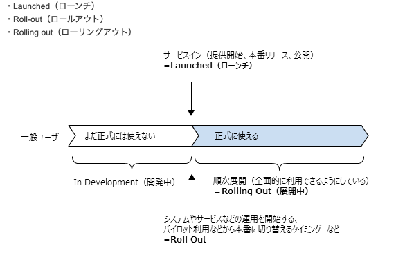

# スケールアップコマンド
```
kubectl scale --replicas=10 deploy helloworld
```
# ローリングアップデート
```
kubectl set image deploy helloworld \
helloworld=gcr.io/google-samples/hello-app:2.0
```
# 一つ前のバージョンにロールバック
```
kubectl rollout undo deploy helloworld
```

因みに個人的にrolloutってどんな状況か気になったので調べてみました。



ローンチ（リリース）後の順次展開中のことをrolloutと言うようで、ようするにupdateって事です。

つまり「kubernetesのdeploymentであるhelloworldの出化状況を元に戻す」と直訳することができます。